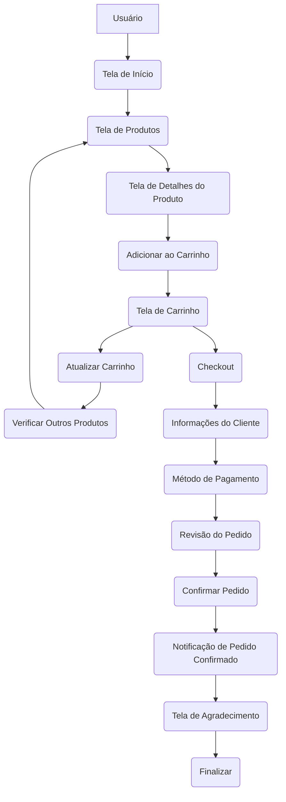

### Fluxo do Aplicativo de E-commerce Mobile

```mermaid
graph TD;
    A[Usuário] --> B(Tela de Início);
    B --> C(Tela de Produtos);
    C --> D(Tela de Detalhes do Produto);
    D --> E(Adicionar ao Carrinho);
    E --> F(Tela de Carrinho);
    F --> G(Atualizar Carrinho);
    G --> H(Verificar Outros Produtos);
    H --> C;
    F --> I(Checkout);
    I --> J(Informações do Cliente);
    J --> K(Método de Pagamento);
    K --> L(Revisão do Pedido);
    L --> M(Confirmar Pedido);
    M --> N(Notificação de Pedido Confirmado);
    N --> O(Tela de Agradecimento);
    O --> P(Finalizar);
```
